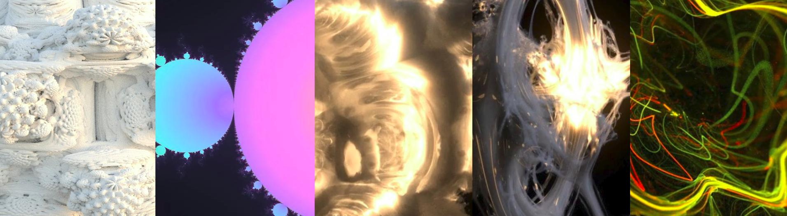
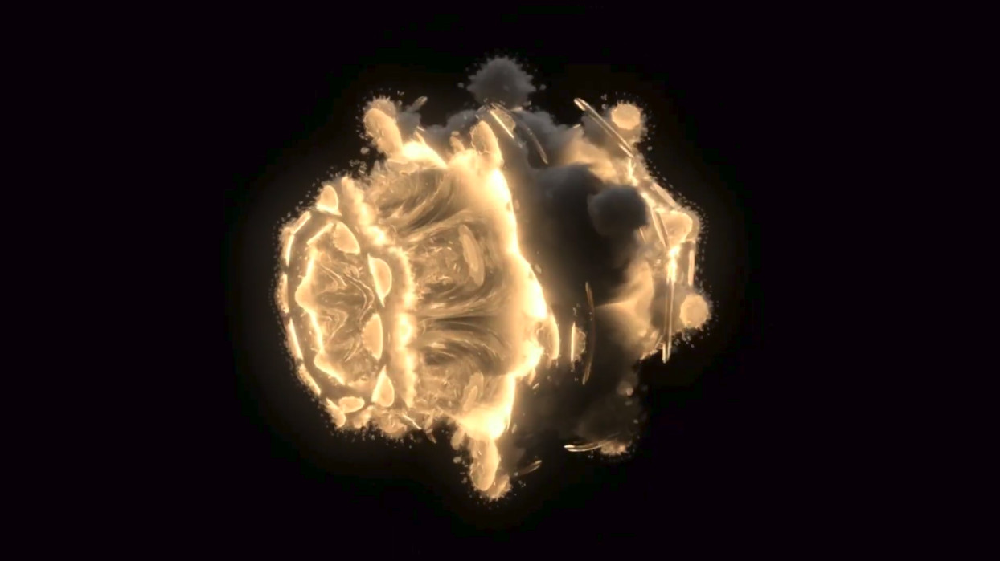
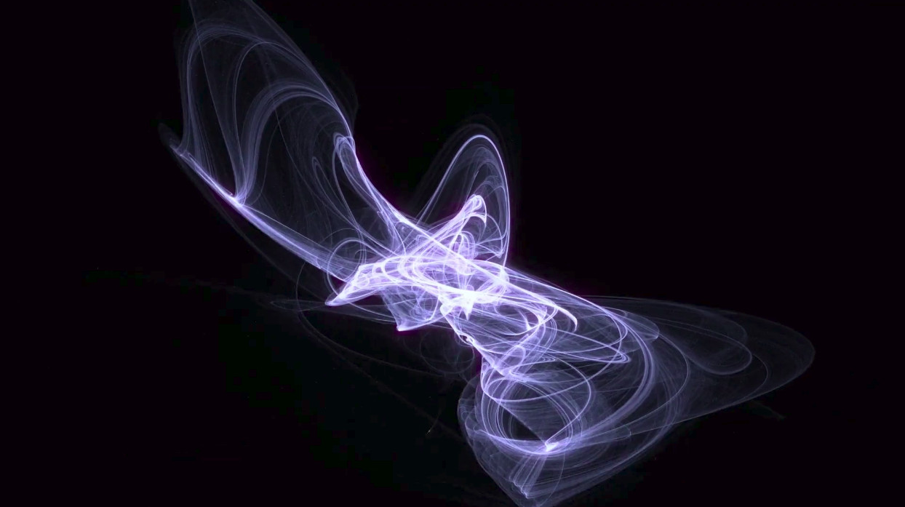
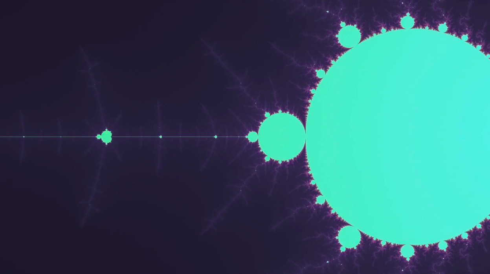
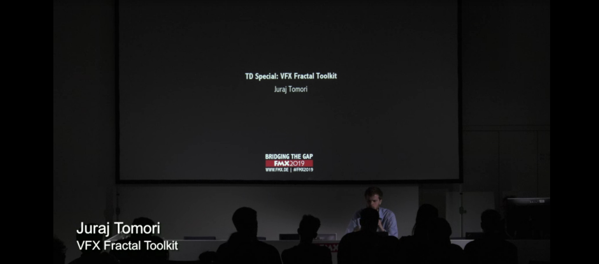
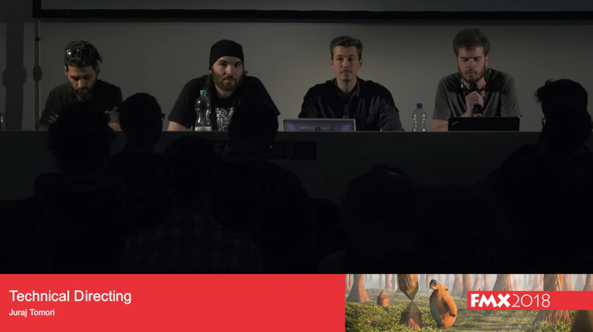

VFX Fractal Toolkit
==========================

*Set of tools for generating fractal and generative art.*

 

## About
This is my graduation project: **VFX Fractal Toolkit** (VFT), which I developed at *Filmakademie Baden-Württemberg* while studying [Technical Directing](https://animationsinstitut.de/de/studium/animation/technical-director/informationen/).

It contains tools written in *OpenCL, OSL, Blink, Python, VEX and JavaScript* intended to be used in *Houdini, Arnold, Nuke or a web browser*.

The code is in prototyping stage and many features are experimental. It is not production ready and some parts need refactoring.

Here are some animations produced with it:

* 
* 
* 

I had a chance to present progress of VFT at two **FMX** conferences (2018, 2019), you can find the recordings here:

* 
* 

This project was presented at **The 15th ACM SIGGRAPH European Conference on Visual Media Production** [(CVMP 2018)](https://www.cvmp-conference.org/2018/programme/) conference: [fast-forward](https://www.youtube.com/watch?v=_CI8GFDmKZQ), [paper](https://animationsinstitut.de/fileadmin/user_upload/files_forschung/pdf/Publications/18_cvmp_vft_juraj_tomori_paper.pdf), [poster](https://animationsinstitut.de/fileadmin/user_upload/files_forschung/pdf/Publications/18_cvmp_vft_juraj_tomori_poster.png).

You can find **comparison of various techniques** (visual quality vs performance) [here](comparison.md).

 

## Resources
* [Mandelbulber2 source code repository](https://github.com/buddhi1980/mandelbulber2/)
* [Mandelbulb3D source code repository](https://github.com/thargor6/mb3d)
* [Capturing the infinite universe in "Lucy": fractal rendering in film production](https://dl.acm.org/citation.cfm?id=2614166)
* [The fractal nature of Guardians of the Galaxy Vol. 2](https://www.fxguide.com/featured/the-fractal-nature-of-guardians-of-the-galaxy-vol-2/)

 

## Thanks
* [Íñigo Quílez](http://www.iquilezles.org/www/index.htm) - great articles on raymarching, fractals, orbit traps, SDFs...
* Krzysztof Marczak - lead Mandelbulber2 developer, supporting via emails
* [Mikael Hvidtfeldt Christensen](http://blog.hvidtfeldts.net/) - great articles on raymarching, fractals, generative art
* [Dom Penfold](http://woo4.me/) - blog with useful articles