Renderers and techniques comparison
==========================

## Techniques

### A) Polygons, converted from sdf
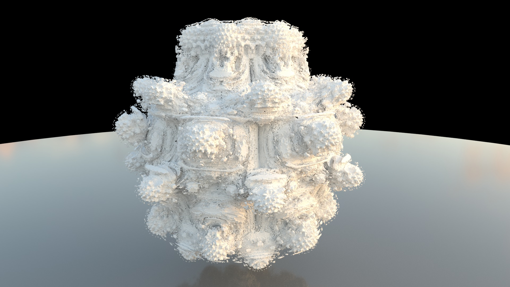 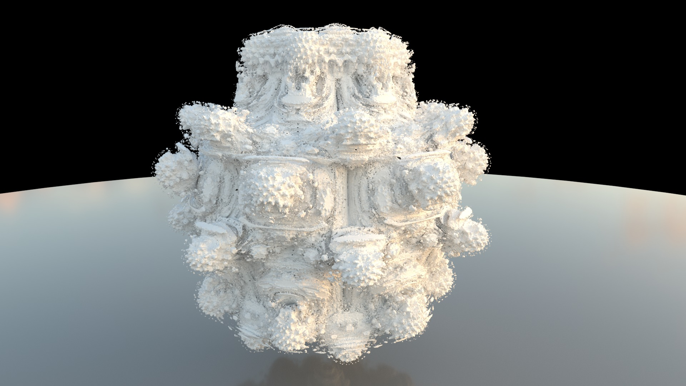 

Mantra ~ 10 min, Arnold ~ 2 min, Redshift ~ 1 min

 

### B) Points (sphere trace), ~ 50.6 M
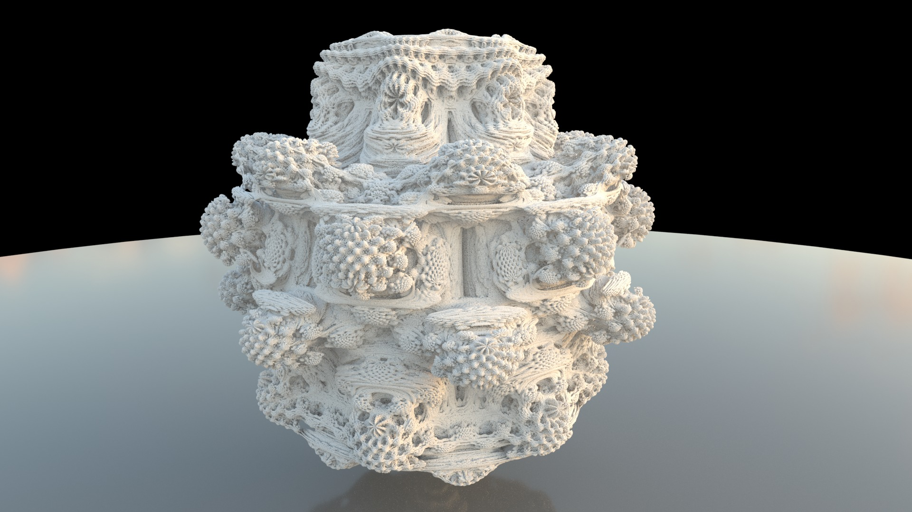 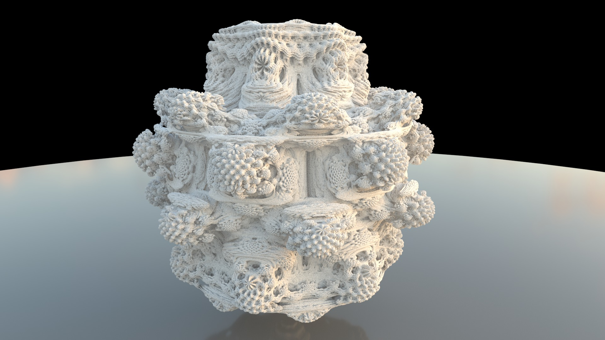 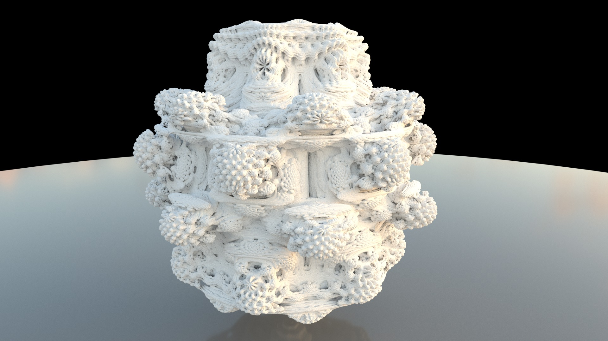

Mantra ~ 11 min, Arnold ~ 4 min, Redshift ~ 4 min

 

### C) Points (perspective camera trace), ~ 10.3 M (4 samples/pixel)
 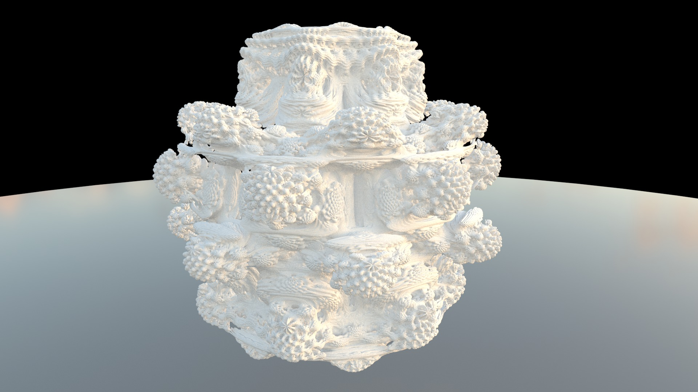 

Mantra ~ 8 min, Arnold ~ 1 min, Redshift ~ 2 min

 

### D) Volume, ~ 90 M voxels
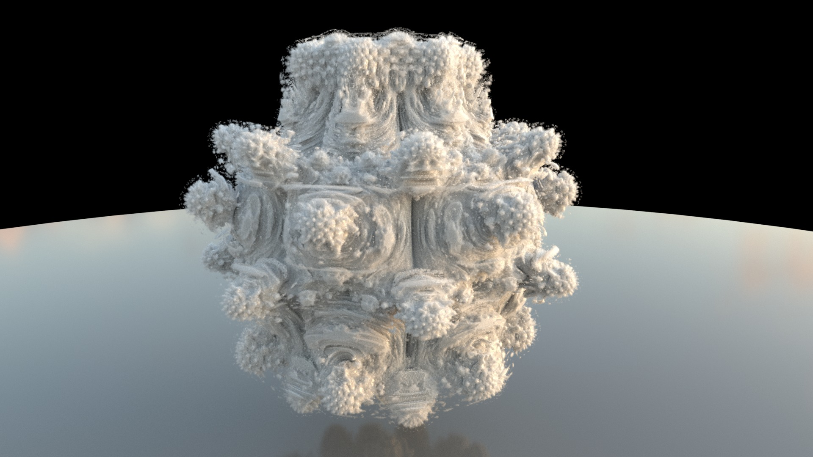   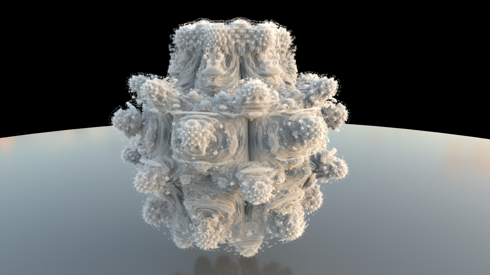

Mantra (with GGX) ~ 13 min, Mantra ~ 8 min, Arnold ~ 9 min, Redshift ~ 1 min

 

### E) SDF, ~ 70 M voxels
 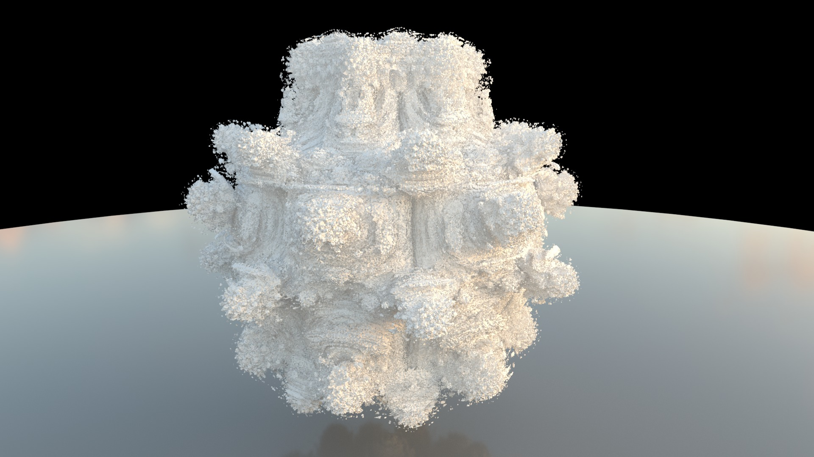

Mantra ~ 16 min, Arnold ~ 3 min

 

## Mantra sdf vs polygons vs points (sphere traced) vs points (camera traced) vs fog vs fog (with GGX)
     

 

## Arnold points (camera traced), ~ 1 min
 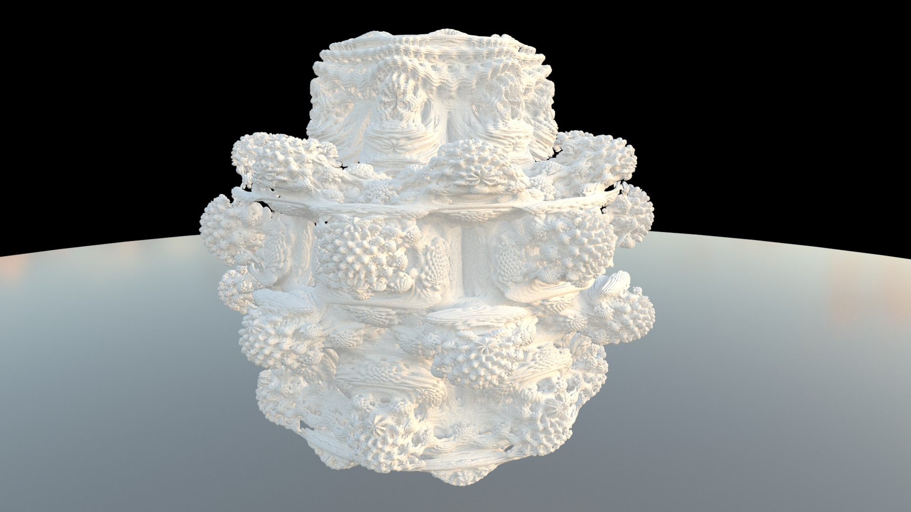  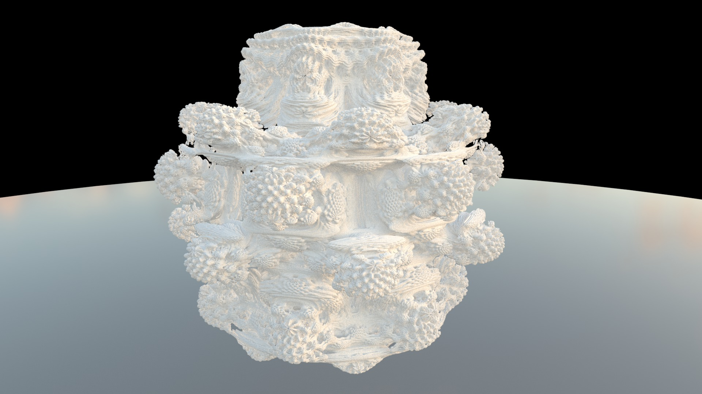

4 spp (~ 10.3 M points), 3 spp (~ 5.8 M points), 2 spp (~ 2.5 M points), 1.5 spp (~ 1.5 M points)

 

## Points (sphere traced) with GGX speculars, ~ 87 M points
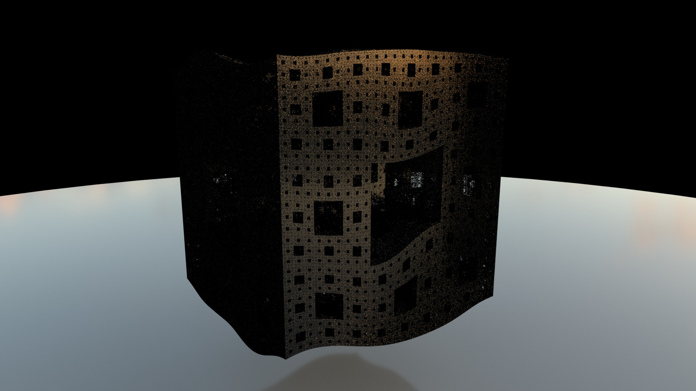  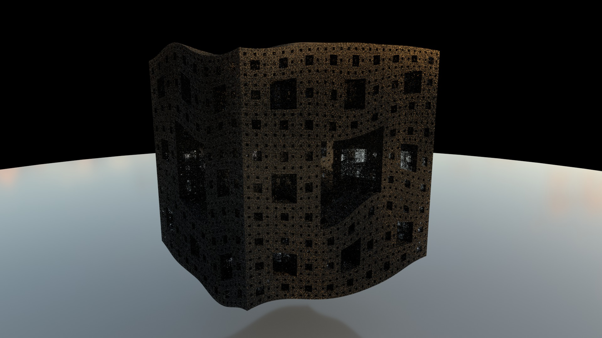 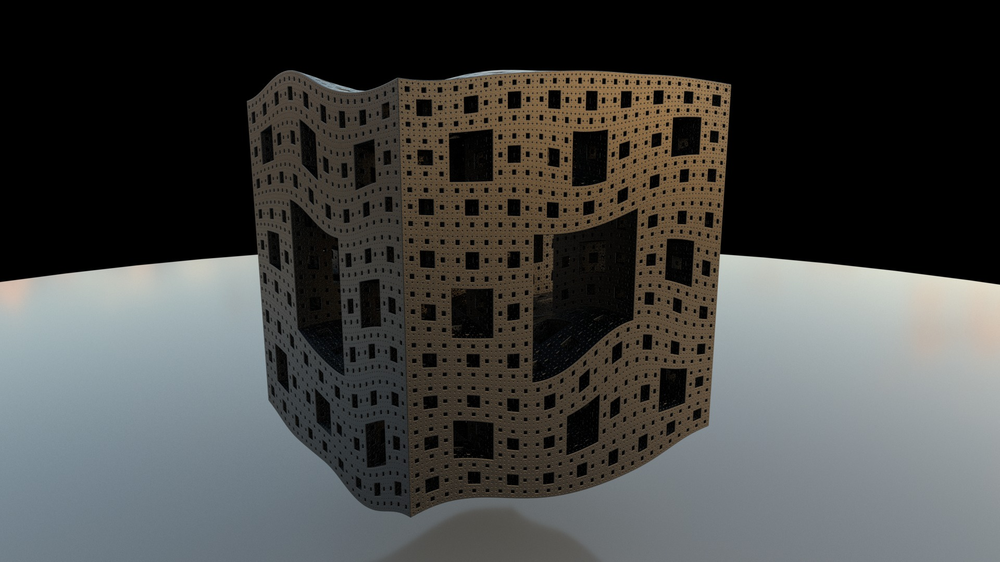

Mantra ~ 3 min, Arnold ~ 1 min (particles as discs with correct normals), Arnold (using instancing, too slow), Redshift ~ 3 min (as spheres - incorrect speculars, instancing not possible because of VRAM)

 

## Grid vs Frustum volumes comparison of volume size and render time
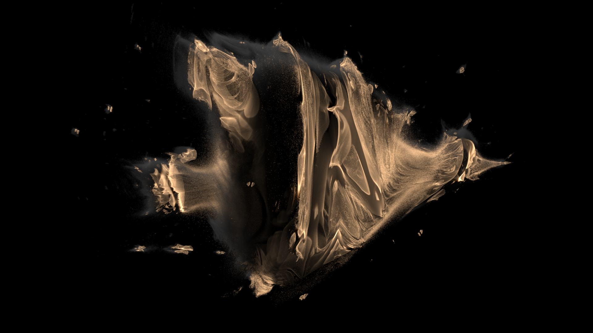    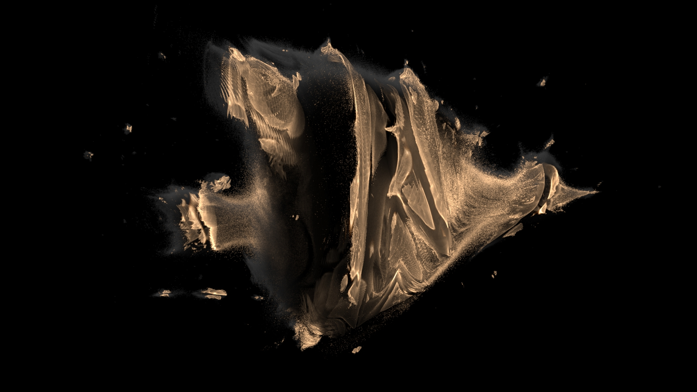

Grid volume (~ 800MB, 272M voxels) - 3:30s, frustum volume 1.0 z (~ 800MB, 272M voxels) - 5:20s, frustum volume 0.75 z (~ 600MB, 204M voxels) - 5:21s, frustum volume 0.5 z (~ 400MB, 136M voxels) - 5:27s, frustum volume 0.25 z (~ 200MB, 68M voxels) - 5:42s

**1.0 z** means scaling of resolution along Z axis (inside of the image)